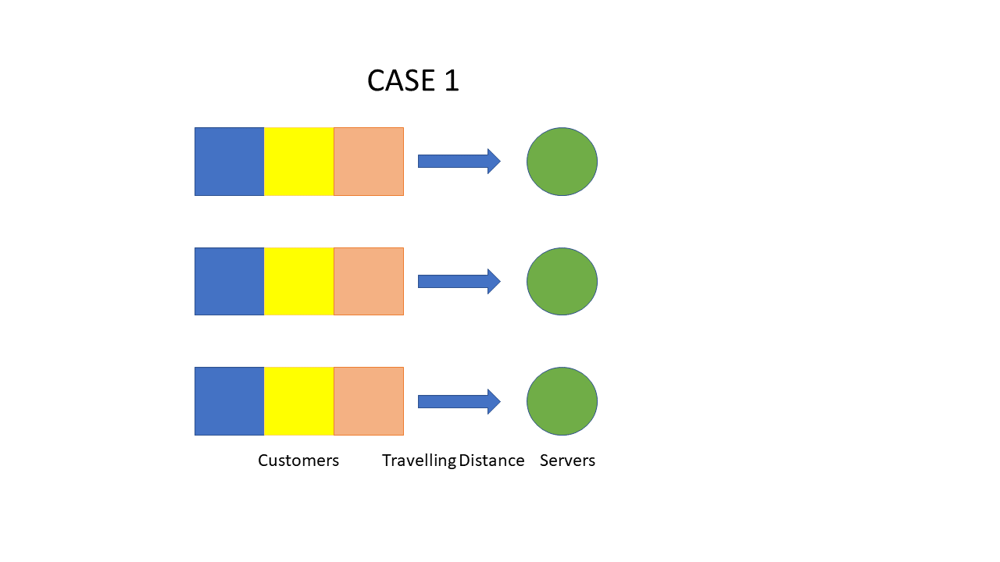
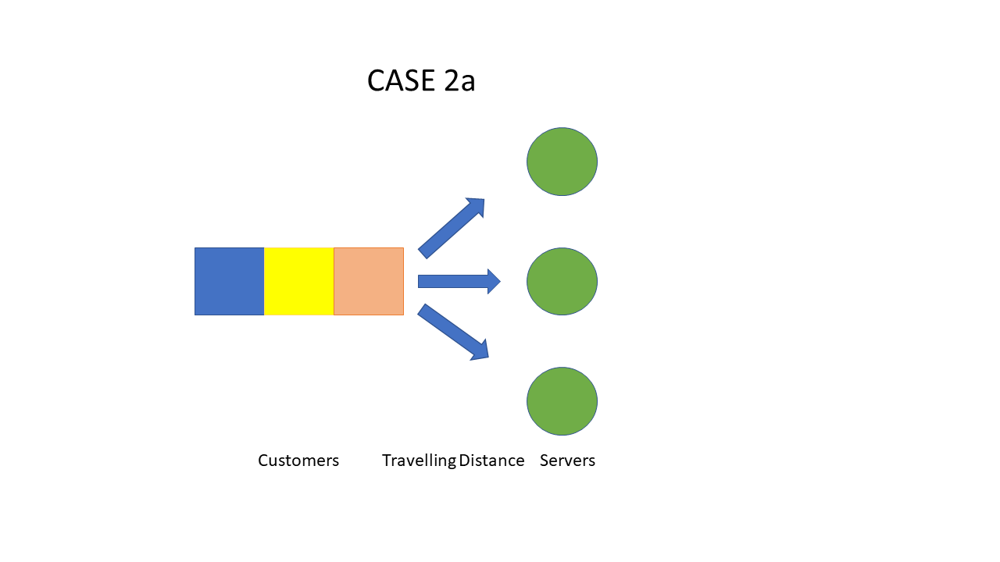
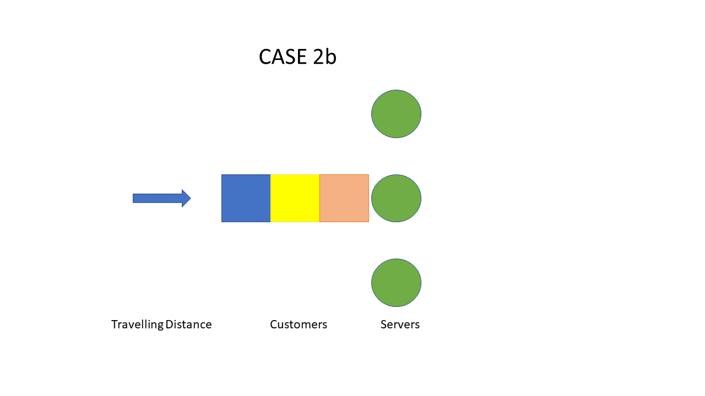

```{r setup, include=FALSE}
knitr::opts_chunk$set(echo = TRUE)
```
# Starting Situation and Work Order
*Model and analyze the following situation using a simulation tool (Simmer or something else). In a system, customers arrive with a specific distribution:*

a) with fixed interarrival times of 120 sec
b) with interarrival times uniformly distributed between 60 and 180 sec
c) with exponentially distributed interarrival times with expected value 120 sec.

*Each of the customers first needs to travel to one service station. The distance is 10m and for the speed 0.5 m/s can be assumed. In total, there are three service stations available for customers.*
*Consider the following two types of assigning service stations to customers:*

1. a round robin method (first customer travels to first service station, second customer to second service station, third customer to third service station, fourth customer to the first service station, etc.)
2. the service stations have a common queue and the next customer is served by the service station which becomes first available (or by an arbitrary service station in case of more than one being available). Distinguish the two cases that the common queue is before the way to the stations (2a) or after it, i.e. directly in front of the service stations (2b). 

*Assume that the service stations require service times, which are uniformly distributed between 300 sec and 400 sec. Further specifications of the system are not given and can be chosen freely.*

*Analyze all 9 combinations of the above assumptions (i.e., a1, b1, c1, a2a, b2a, c2a, a2b, b2b, and c2b) by simulation runs of about 4 hours. During the simulations check for situations of congestion and try to answer the following questions:*

* How many customers are served on average during an hour at each of the service stations?
* What is the degree of utilization at each of the service stations?
* What is the average length of the queues?
* What is the average throughput time of the customers?

*Please provide a written report of your results. You should describe the main modeling concepts as well (e.g., design of the system and used elements) including code and problems observed during modeling and simulation runs (if there were any).*


```{r message=FALSE, warning=FALSE, include=FALSE}
# Preliminaries
rm(list = ls()) 
set.seed(3)
library(simmer)
library(simmer.plot)
library(dplyr)
library(ggplot2)
library(knitr)
library(forestmangr)
library(data.table)

result_header <- c("customer_per_hour_per_station","degree_of_utilization_1","degree_of_utilization_2", 
                   "degree_of_utilization_3", "average_queue_length_1", "average_queue_length_2", 
                     "average_queue_length_3","avg_customer_through_put_time")

# global variables
fix_interarrival_time<-120
unif_interarrval_time_lwr<-60
unif_interarrval_time_upr<-180
exp_interarrival_time<-1/120
timeout<-20
run_time<-14400
service_time_lwr=300
service_time_upr=400


```

## Main Modeling Concepts

In this section, we will go over the main concepts of simulation modeling. All given values, like interarrival time or timeout are defined as global variables. The following lines of code were used to spawn the customers during simulation to represent the circumstances of the interarrival times of a, b, and c:
  
a) For fixed interarrival times of 120 seconds:
  ```add_generator("Customer", customer, from_to(0, run_time, function() {fix_interarrival_time}))``

b) For interarrival times uniformly distributed between 60 and 120 seconds:
  - ```add_generator("Customer", customer, from_to(0, run_time, function() {runif(1, min = unif_interarrval_time_lwr, max = unif_interarrval_time_upr)}))```

c) For exponentially distributed interarrival times with an expected value of 120 seconds:
  - ```add_generator("Customer", customer, from_to(0, run_time, function() {rexp(1, rate = exp_interarrival_time)}))```

Customers must travel to the service station and cover a distance of 10 meters at 0.5 m/s, therefore a timeout of 20 seconds is added at the corresponding position: ```timeout(function() {timeout})```. 

The service's time is implemented as a uniformly distributed timeout between 300 and 400 seconds: ```timeout(function() {runif(1, min=service_time_lwr, max=service_time_upr)})```.  

The difference in the implementation between the cases in 1 and the cases 2A and 2B consists of 3 real resources with an own queue each in 1:

Case 1 (Round Robin) is modelled as follows with 3 real resources with an own queue.
``` 
add_resource("service_station_1", 1) %>% 
add_resource("service_station_2", 1) %>% 
add_resource("service_station_3", 1) 
```
Cases 2A and 2B are modelled with a common resource but increased capacity of 3.
```
add_resource("service_station", 3)
```

The results obtained are stored in a result matrix, which is presented and discussed in the end. 

```{r eval=FALSE, include=FALSE}
# I dont get this
# 
# *As consequence of this approach, the results of all cases of 2A and 2B covering the different service stations are divided through 3. This is the case because it is not possible to simulate this situation differently with simmer because adding resources adds a queue automatically which would then violate the requirements of the scenario. Can be seen [here](https://r-simmer.org/reference/add_resource.html). In addition to that the policy of the queues would end up affecting the results in a negative way. So for example all "-available-ending" policies raised errors which can't be handled properly and result in missing customers in the simulation as soon as an error is thrown but not logged. Can be found [here](https://r-simmer.org/reference/select.html).*  
# 
# All further modeling aspects are briefly described and illustrated in the simulation of the respective case. In addition to that comments in the code describe the reason of the actions where they are performed.   
```

# Scenario 1



Text Description missing


## CASE A1  

- Customers arrive with fixed interarrival times of 120 seconds
- The queues are chosen with a round robin method
- The way to the service station is between the queue and the actual service station. Thus, the server is blocked as soon as the customer served the queue
- The service time is uniformly distributed between 300 and 400 seconds

```{r warning=FALSE}
service_system <- simmer()
#define the trajectory for Cases A1, B1, C1
customer <- trajectory("serve customer") %>%
  set_attribute("start_time", function() {now(service_system)}) %>%
  simmer::select(c("service_station_1", "service_station_2","service_station_3"), policy = "round-robin") %>%
  seize_selected() %>%
  log_(function() {paste("Waited: ", now(service_system) - get_attribute(service_system, "start_time"))}) %>%
  timeout(function() {timeout}) %>%
  log_("customer arrival at the service station") %>%
  timeout(function() {runif(1, min=service_time_lwr, max=service_time_upr)}) %>%
  release_selected() %>%
  log_("customer served")%>%
  log_(function() {paste("Finished: ", now(service_system))})

service_system <-
  simmer("service_system") %>%
  add_resource("service_station_1", 1) %>% 
  add_resource("service_station_2", 1) %>% 
  add_resource("service_station_3", 1) %>% 
  add_generator("Customer", customer, from_to(0, run_time, function() {fix_interarrival_time}))
```


```{r message=FALSE, warning=FALSE, include=TRUE, echo=T, results='hide'}
service_system %>% run(until = run_time)

result <- data.frame(service_system %>%
  get_mon_arrivals() %>%
  transform(waiting_time = end_time - start_time - activity_time) %>%
  transform(actual_service_time = activity_time-timeout)
  )


merged_results <- merge(result,get_mon_resources(service_system), by = "time", "start_time")
filtered_1 <- filter(merged_results,resource == "service_station_1")
filtered_2 <- filter(merged_results,resource == "service_station_2")
filtered_3 <- filter(merged_results,resource == "service_station_3")


arrivals_a1 <- get_mon_arrivals(service_system)
resources_a1 <- get_mon_arrivals(service_system)
```


```{r}
# Calculation of the averaged customers served per hour:
results_a1 <- c(length(result$finished==TRUE)/4/3)
customers_served <- length(result$finished==TRUE)/4/3
# Calculation of the occupation of the service stations:
results_a1 <- c(results_a1,sum(filtered_1$actual_service_time)/(run_time),
                  sum(filtered_2$actual_service_time)/(run_time),
                  sum(filtered_3$actual_service_time)/(run_time))
# Calculation of the queue means:
results_a1 <- c(results_a1, mean(filtered_1$queue),
                  mean(filtered_2$queue),
                  mean(filtered_3$queue))
# Calculation of the throughput time
results_a1 <- c(results_a1,mean(result$activity_time+result$waiting_time))
```

## CASE B1

- Customers arrive with uniformly distributed interarrival times 
- The queues are chosen with a round robin method
- The way to the service station is between the queue and the actual service station. Thus, the server is blocked as soon as the customer served the queue
- The service time is uniformly distributed between 300 and 400 seconds

```{r warning=FALSE}
service_system <- simmer()

service_system <-
  simmer("service_system") %>%
  add_resource("service_station_1", 1) %>% 
  add_resource("service_station_2", 1) %>% 
  add_resource("service_station_3", 1) %>% 
  add_generator("Customer", customer, from_to(0, run_time, function() {runif(1, min = unif_interarrval_time_lwr, max = unif_interarrval_time_upr)}))

```

```{r message=FALSE, warning=FALSE, include=TRUE, echo=T, results='hide'}
service_system %>% run(until = run_time)
```

```{r include=FALSE}
result <- data.frame(service_system %>%
  get_mon_arrivals() %>%
  transform(waiting_time = end_time - start_time - activity_time) %>%
  transform(actual_service_time = activity_time-timeout)
  )

merged_results <- merge(result,get_mon_resources(service_system), by = "time", "start_time")
filtered_1 <- filter(merged_results,resource == "service_station_1")
filtered_2 <- filter(merged_results,resource == "service_station_2")
filtered_3 <- filter(merged_results,resource == "service_station_3")

arrivals_b1 <- get_mon_arrivals(service_system)
resources_b1 <- get_mon_arrivals(service_system)
results_b1 <- c(length(result$finished==TRUE)/4/3)
customers_served <- length(result$finished==TRUE)/4/3
results_b1 <- c(results_b1,sum(filtered_1$actual_service_time)/(run_time),
                  sum(filtered_2$actual_service_time)/(run_time),
                  sum(filtered_3$actual_service_time)/(run_time))
results_b1 <- c(results_b1, mean(filtered_1$queue),
                  mean(filtered_2$queue),
                  mean(filtered_3$queue))
results_b1 <- c(results_b1,mean(result$activity_time+result$waiting_time))
```

## CASE C1
Short description:  

- Customers arrive with exponentially distributed interarrival times with expected value 120 sec
- The queues are chosen with a round robin method
- The way to the service station is between the queue and the actual service station. Thus, the server is blocked as soon as the customer served the queue
- The service time is uniformly distributed between 300 and 400 seconds


```{r warning=FALSE}
service_system <- simmer()

service_system <-
  simmer("service_system") %>%
  add_resource("service_station_1", 1) %>% 
  add_resource("service_station_2", 1) %>% 
  add_resource("service_station_3", 1) %>% 
  add_generator("Customer", customer, from_to(0, run_time, function() {rexp(1, rate = exp_interarrival_time)}))
```

```{r message=FALSE, warning=FALSE, include=TRUE, echo=T, results='hide'}

service_system %>% run(until = run_time)
```

```{r include=FALSE}
result <- data.frame(service_system %>%
  get_mon_arrivals() %>%
  transform(waiting_time = end_time - start_time - activity_time) %>%
  transform(actual_service_time = activity_time-timeout)
  )
merged_results <- merge(result,get_mon_resources(service_system), by = "time", "start_time")
filtered_1 <- filter(merged_results,resource == "service_station_1")
filtered_2 <- filter(merged_results,resource == "service_station_2")
filtered_3 <- filter(merged_results,resource == "service_station_3")

arrivals_c1 <- get_mon_arrivals(service_system)
resources_c1 <- get_mon_arrivals(service_system)
results_c1 <- c(length(result$finished==TRUE)/4/3)
customers_served <- length(result$finished==TRUE)/4/3

results_c1 <- c(results_c1,sum(filtered_1$actual_service_time)/(run_time),
                  sum(filtered_2$actual_service_time)/(run_time),
                  sum(filtered_3$actual_service_time)/(run_time))
results_c1 <- c(results_c1, mean(filtered_1$queue),
                  mean(filtered_2$queue),
                  mean(filtered_3$queue))
results_c1 <- c(results_c1,mean(result$activity_time+result$waiting_time))
```


# Scenario 2A


## CASE A2A
Short description:  

- Customers arrive with fixed interarrival times of 120 seconds
- Common queue before the way to the service station
- The way to the service station is between the queue and the actual service station. So, the block of the service station is already done as soon as the customer served the queue and gets on the way to the service station
- The service times are uniformly distributed between 300 and 400 seconds


```{r}
service_system <- simmer()

customer <-
  trajectory("serve customer") %>%
  set_attribute("start_time", function() {now(service_system)}) %>%
  seize("service_station") %>%
  log_(function() {paste("Waited: ", now(service_system) - get_attribute(service_system, "start_time"))}) %>%
  log_("Customer moves to the service station") %>%
  timeout(timeout) %>% 
  log_("customer arrival service station") %>%
  timeout(function() {runif(1, min=service_time_lwr, max=service_time_upr)}) %>%
  release("service_station") %>%
  log_("customer served")%>%
  log_(function() {paste("Finished: ", now(service_system))})
  
service_system <-
  simmer("service_system") %>%
  add_resource("service_station", 3) %>% 
  add_generator("Customer", customer, from_to(0, run_time, function() {fix_interarrival_time}))
```

```{r message=FALSE, warning=FALSE, include=TRUE, echo=T, results='hide'}
service_system %>% run(until = run_time)
```

```{r include=FALSE}
result <- data.frame(service_system %>%
  get_mon_arrivals() %>%
  transform(waiting_time = end_time - start_time - activity_time) %>%
  transform(actual_service_time = activity_time-timeout)
  )
result <- merge(result, get_mon_resources(service_system), by = "time", "start_time")

arrivals_a2a <- get_mon_arrivals(service_system)
resources_a2a <- get_mon_arrivals(service_system)
results_a2a <- c(length(result$finished==TRUE)/4/3)
customers_served <- length(result$finished==TRUE)/4/3

results_a2a <- c(results_a2a,sum(result$actual_service_time)/(run_time*3),
                  sum(result$actual_service_time)/(run_time*3),
                  sum(result$actual_service_time)/(run_time*3))
results_a2a <- c(results_a2a, mean(result$queue),
                  mean(result$queue),
                  mean(result$queue))
results_a2a <- c(results_a2a,mean(result$activity_time+result$waiting_time))
```

## CASE B2A
Short description:  

- Customers arrive with interarrival times which are uniformly distributed between 60 and 180 seconds
- Common queue before the way to the service station
- The way to the service station is between the queue and the actual service station. So, the block of the service station is already done as soon as the customer served the queue and gets on the way to the service station
- The service times are uniformly distributed between 300 and 400 seconds

```{r}
service_system <- simmer()

service_system <-
  simmer("service_system") %>%
  add_resource("service_station", 3) %>% 
  add_generator("Customer", customer, from_to(0, run_time, function() {runif(1, min = unif_interarrval_time_lwr, max = unif_interarrval_time_upr)}))
```

```{r message=FALSE, warning=FALSE, include=TRUE, echo=T, results='hide'}
service_system %>% run(until = run_time)
```

```{r include=FALSE}
result <- data.frame(service_system %>%
  get_mon_arrivals() %>%
  transform(waiting_time = end_time - start_time - activity_time) %>%
  transform(actual_service_time = activity_time-timeout)
  )
result <- merge(result, get_mon_resources(service_system), by = "time", "start_time")

arrivals_b2a <- get_mon_arrivals(service_system)
resources_b2a <- get_mon_arrivals(service_system)
results_b2a <- c(length(result$finished==TRUE)/4/3)
customers_served <- length(result$finished==TRUE)/4/3

results_b2a <- c(results_b2a,sum(result$actual_service_time)/(run_time*3),
                  sum(result$actual_service_time)/(run_time*3),
                  sum(result$actual_service_time)/(run_time*3))
results_b2a <- c(results_b2a, mean(result$queue),
                  mean(result$queue),
                  mean(result$queue))
results_b2a <- c(results_b2a,mean(result$activity_time+result$waiting_time))
```

## CASE C2A
Short description:  

- Customers arrive with exponentially distributed interarrival times with expected value 120 sec
- Common queue before the way to the service station
- The way to the service station is between the queue and the actual service station. So, the block of the service station is already done as soon as the customer served the queue and gets on the way to the service station
- The service times are uniformly distributed between 300 and 400 seconds

```{r}
service_system <- simmer()

service_system <-
  simmer("service_system") %>%
  add_resource("service_station", 3) %>% 
  add_generator("Customer", customer, from_to(0, run_time, function() {rexp(1, rate = exp_interarrival_time)}))
```

```{r include=FALSE}
service_system %>% run(until = run_time)
```


```{r include=FALSE}
result <- data.frame(service_system %>%
  get_mon_arrivals() %>%
  transform(waiting_time = end_time - start_time - activity_time) %>%
  transform(actual_service_time = activity_time-timeout)
  )
result <- merge(result, get_mon_resources(service_system), by = "time", "start_time")

arrivals_c2a <- get_mon_arrivals(service_system)
resources_c2a <- get_mon_arrivals(service_system)
results_c2a <- c(length(result$finished==TRUE)/4/3)
customers_served <- length(result$finished==TRUE)/4/3
results_c2a <- c(results_c2a,sum(result$actual_service_time)/(run_time*3),
                  sum(result$actual_service_time)/(run_time*3),
                  sum(result$actual_service_time)/(run_time*3))
results_c2a <- c(results_c2a, mean(result$queue),
                  mean(result$queue),
                  mean(result$queue))
results_c2a <- c(results_c2a,mean(result$activity_time+result$waiting_time))
```

# Scenario 2B


## CASE A2B

Short description:  

- Customers arrive with fixed interarrival times of 120 seconds
- The Common queue is located directly in front of the service station. In this case, the assumption is made as shown above that the way now is infront of the queue instead of the service station. The start time is set as soon as the customer arrival the queue.
- The service times are uniformly distributed between 300 and 400 seconds 


```{r}
service_system <- simmer()

customer <- trajectory("serve customer") %>%
  log_("Customer walks to the queue") %>%
  timeout(function() {timeout}) %>%
  log_("customer arrival at the queue") %>%
  set_attribute("start_time", function() {now(service_system)}) %>%
  seize("service_station") %>%
  log_(function() {paste("Waited: ", now(service_system) - get_attribute(service_system, "start_time"))}) %>%
  log_("customer arrival service station") %>%
  timeout(function() {runif(1, min=service_time_lwr, max=service_time_upr)}) %>%
  release("service_station") %>%
  log_("customer served")%>%
  log_(function() {paste("Finished: ", now(service_system))})
  
service_system <-
  simmer("service_system") %>%
  add_resource("service_station", 3) %>%
  add_generator("Customer", customer, from_to(0, run_time, function() {fix_interarrival_time}))
```

```{r message=FALSE, warning=FALSE, include=TRUE, echo=T, results='hide'}
service_system %>% run(until = run_time)
```


```{r include=FALSE}
result <- data.frame(service_system %>%
  get_mon_arrivals() %>%
  transform(waiting_time = end_time - start_time - activity_time) %>%
  transform(actual_service_time = activity_time-timeout)%>%
  transform(time = start_time + timeout)
  )
result <- merge(result, get_mon_resources(service_system), by = "time", "time")

arrivals_a2b <- get_mon_arrivals(service_system)
resources_a2b <- get_mon_arrivals(service_system)
results_a2b <- c(length(result$finished==TRUE)/4/3)
customers_served <- length(result$finished==TRUE)/4/3
results_a2b <- c(results_a2b,sum(result$actual_service_time)/(run_time*3),
                  sum(result$actual_service_time)/(run_time*3),
                  sum(result$actual_service_time)/(run_time*3))
results_a2b <- c(results_a2b, mean(result$queue),
                  mean(result$queue),
                  mean(result$queue))
results_a2b <- c(results_a2b,mean(result$activity_time+result$waiting_time))
```

## CASE B2B

Short description:  

- Customers arrive with interarrival times which are uniformly distributed between 60 and 120 seconds
- The Common queue is located directly in front of the service station. In this case, the assumption is made as shown above that the way now is infront of the queue instead of the service station. The start time is set as soon as the customer arrival the queue.
- The service times are uniformly distributed between 220sec and 300sec  


```{r}
service_system <- simmer()

service_system <-
  simmer("service_system") %>%
  add_resource("service_station", 3) %>%
  add_generator("Customer", customer, from_to(0, run_time, function() {runif(1, min = unif_interarrval_time_lwr, max = unif_interarrval_time_upr)}))
```

```{r message=FALSE, warning=FALSE, include=TRUE, echo=T, results='hide'}
service_system %>% run(until = run_time)
```


```{r include=FALSE}
result <- data.frame(service_system %>%
  get_mon_arrivals() %>%
  transform(waiting_time = end_time - start_time - activity_time) %>%
  transform(actual_service_time = activity_time-timeout)%>%
  transform(time = start_time + timeout)
  )
result <- merge(result, get_mon_resources(service_system), by = "time", "time")

arrivals_b2b <- get_mon_arrivals(service_system)
resources_b2b <- get_mon_arrivals(service_system)
results_b2b <- c(length(result$finished==TRUE)/4/3)
customers_served <- length(result$finished==TRUE)/4/3

results_b2b <- c(results_b2b,sum(result$actual_service_time)/(run_time*3),
                  sum(result$actual_service_time)/(run_time*3),
                  sum(result$actual_service_time)/(run_time*3))
results_b2b <- c(results_b2b, mean(result$queue),
                  mean(result$queue),
                  mean(result$queue))
results_b2b <- c(results_b2b,mean(result$activity_time+result$waiting_time))
```

## CASE C2B
Short description:  

- Customers arrive with exponentially distributed interarrival times with expected value 120 sec
- Common queue before the way to the service station
- The way to the service station is between the queue and the actual service station. So, the block of the service station is already done as soon as the customer served the queue and gets on the way to the service station
- The service times are uniformly distributed between 300 and 400 seconds 

```{r}
service_system <- simmer()
  
service_system <-
  simmer("service_system") %>%
  add_resource("service_station", 3) %>%
  add_generator("Customer", customer, from_to(0, run_time, function() {rexp(1, rate = exp_interarrival_time)}))

```

```{r message=FALSE, warning=FALSE, include=TRUE, echo=T, results='hide'}
service_system %>% run(until = run_time)
```

```{r include=FALSE}
result <- data.frame(service_system %>%
  get_mon_arrivals() %>%
  transform(waiting_time = end_time - start_time - activity_time) %>%
  transform(actual_service_time = activity_time-timeout)%>%
  transform(time = start_time + timeout)
  )
result <- merge(result, get_mon_resources(service_system), by = "time", "time")

arrivals_c2b <- get_mon_arrivals(service_system)
resources_c2b <- get_mon_arrivals(service_system)
results_c2b <- c(length(result$finished==TRUE)/4/3)
customers_served <- length(result$finished==TRUE)/4/3
results_c2b <- c(results_c2b,sum(result$actual_service_time)/(run_time*3),
                  sum(result$actual_service_time)/(run_time*3),
                  sum(result$actual_service_time)/(run_time*3))
results_c2b <- c(results_c2b, mean(result$queue),
                  mean(result$queue),
                  mean(result$queue))
results_c2b <- c(results_c2b,mean(result$activity_time+result$waiting_time))
```


# Result Interpretation and Comparison

```{r include=FALSE, layout="l-body-outset"}
result_matrix <- round_df(data.frame("Values"=result_header, "CASE A1"= results_a1, "CASE B1" = results_b1, "CASE C1" = results_c1, "CASE A2A" = results_a2a, "CASE B2A" = results_b2a, "CASE C2A" = results_c2a, "CASE A2B" = results_a2b, "CASE B2B" = results_b2b, "CASE C2B" = results_c2b),digits = 2)

t_result_matrix <- transpose(result_matrix)
colnames(t_result_matrix) <- rownames(result_matrix)
rownames(t_result_matrix) <- colnames(result_matrix)
```

## *Overview of all results*

The following table shows all results of the different simulations performed with simmer.
```{r, layout="l-body-outset"}
kable(result_matrix)
```

A detailed analysis can be found in the answers of the following questions.

_-How many customers are served on average during an hour at each of the service stations?_
The results of the service systems can be found in the table below:  
```{r}
kable(data.frame("Context" = rownames(t_result_matrix), "Value" = t_result_matrix[,1]))
```

We calculated our results under the condition set.seed(63). By setting the seed to 63 we ensured that we use a random number generator, which is useful for creating simulations that can be reproduced. Every simulation run has therefore the same result for the 4 hours simulation.

With the settings used in the simulation the most efficient service station would be B2B by serving 13.17 customers on average during an hour service. Nevertheless, this could also just be the case because of the random distribution on set.seed(63). Under other conditions where the disitribution of the arrival time would lean more to 120 seconds instead of 60 seconds the result could differ. Since A2B with fixed interarrival times of 90 seconds also is showing a good result we can asume that the service system is working better than the others.
If we calculate the average arriving rate with 3600/90/3 = **13.33** it would indicate that all systems are not stable since the arrival rate is larger than the service rate. Neverthess, A2B and B2B would be really close to this number.

_-What is the degree of utilization at each of the service stations?_  
The results of the service systems can be found in the table below. Please consider that in simmer for a service system with one queue for multiple service station (counters) is simulated as a capacity of three for one service station. Therefore, the individual service station results of 2a and 2b cannot be displayed separately which leads to three identical values in these cases.
```{r}
kable(data.frame("Value" = t_result_matrix[,2:4]))
```

The degree of utilization at each of the service stations is bellow 100% as in the beginning the first 2 service stations are idle. The third service station gets the first customer on average only after 180s of service. An additional factor for the service stations are not beeing fully utilized is the time where the customer walks to the service station (25 seconds). During this time the service stations are idle as well. So even if the customer arrival rate is higher than the service rate the service station with the highest utilization is only at 0.95 % ( A2B and B2B). It is therefore no considered that these two stations had the highest customer service rate since all stations have equal service rates but these 2 stations are just more in use.

_-What is the average length of the queues?_   
The results of the service systems can be found in the table below. Please consider that in simmer for a service system with one queue for multiple service station (counters) is simulated as a capacity of three for one service station. Therefore, the individual service station results of 2a and 2b cannot be displayed separately which leads to three identical values in these cases.
```{r}
kable(data.frame("Value" = t_result_matrix[,5:7]))
```

The average length of the queues is between 0.59(A2B) & 8.7 (C2A) and differs therefore heavily. The aspect that the simulation is only done for 4 hours has to be considered when looking at these numbers. In the beginning there was at in none of the scenarios a queue since the customers just arrived one after another. As the plots in the following answers show are most queues having a positive slope for the customer throughput. The rising throughput time obviously impacts the queue length. The length of the queue for the simulations would thus rise to infinity if the simulation time of A1/B1/A2A/B2A/C2A be prolonged. C1 and C2B look suspicious but no definite Conclusion can be drawn. Only A2A and B2B seems to look stable.
   
_-What is the average throughput time of the customers?_   
The results of the service systems can be found in the table below:
```{r}
kable(data.frame("Context" = rownames(t_result_matrix), "Value" = t_result_matrix[,8]))
```

The average throughput time of the customers is between 299.62 seconds (A2B) & 1074.62 seconds (C2A) and differs therefore also heavily. The aspect that the simulation is only done for 4 hours has to be considered when looking at these numbers. As the plots in the paper show most models have as well a positive slope for the throughput time which would therefore also rise to infinity if the simulation time would be prolonged (see example of C2A). In contrast the slope of A2B looks stable.

See example C2A with a positive slope for the flow time
```{r message=FALSE, warning=FALSE}
plot(arrivals_c2a, metric = "flow_time")
```

See example A2B with a stable flow time
```{r message=FALSE, warning=FALSE}
plot(arrivals_a2b, metric = "flow_time")
```

\newpage

## Conclusion
If we just consider the average service rate per service station and the average arrival rate of the customers (~ 90 seconds) all systems seem to not be stable. When λ is greater or equal to μ, the queue becomes infinite long. The workload ρ should always  be smaller than 1 which is in none of the scenatios the case. Nevertheless the two best functioning simulations were A2A and B2B which seem to function properly in the simulations done.

```{r eval=FALSE, include=FALSE}
Alle runtime infos in den variablen zur plot koordination:

arrivals_a1
resources_a1
arrivals_b1
resources_b1
arrivals_c1
resources_c1
arrivals_a2a
resources_a2a
arrivals_b2a
resources_b2a
arrivals_c2a
resources_c2a
arrivals_a2b
resources_a2b
arrivals_b2b
resources_b2b
arrivals_c2b
resources_c2b
```


Plots of the flow time from all models:

*CASE A1*
```{r message=FALSE, warning=FALSE}
plot(arrivals_a1, metric = "flow_time")
```
  
*CASE B1*
```{r message=FALSE, warning=FALSE}
plot(arrivals_b1, metric = "flow_time")
```
  
*CASE C1*
```{r message=FALSE, warning=FALSE}
plot(arrivals_c1, metric = "flow_time")
```
  
*CASE A2A*
```{r message=FALSE, warning=FALSE}
plot(arrivals_a2a, metric = "flow_time")
```
  
*CASE B2A*
```{r message=FALSE, warning=FALSE}
plot(arrivals_b2a, metric = "flow_time")
```
  
*CASE C2A*
```{r message=FALSE, warning=FALSE}
plot(arrivals_c2a, metric = "flow_time")
```
  
*CASE A2B*
```{r message=FALSE, warning=FALSE}
plot(arrivals_a2b, metric = "flow_time")
```
  
*CASE B2B*
```{r message=FALSE, warning=FALSE}
plot(arrivals_b2b, metric = "flow_time")
```
  
*CASE C2B*
```{r message=FALSE, warning=FALSE}
plot(arrivals_c2b, metric = "flow_time")
```
